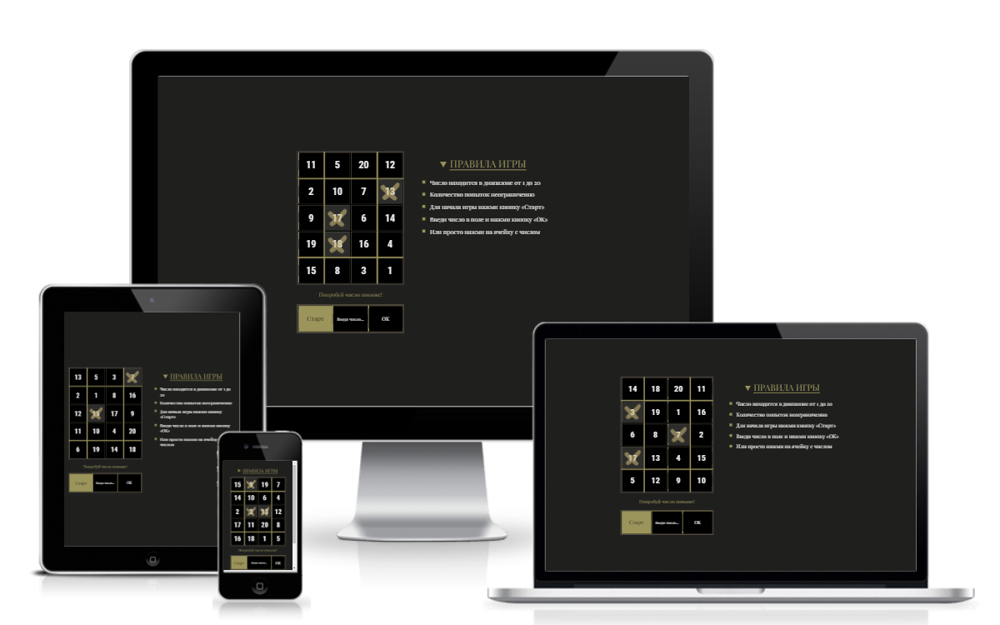

<h1> Угадай число </h1>
<a href="https://pstnv-guess-anumber.glitch.me/"> https://pstnv-guess-anumber.glitch.me </a>

  

 

<h2> О проекте </h2>

 Отвлекитесь на минутку и сыграйте с компьютером в игру "Угадай число". 

 

<h2> Используемые технологии </h2>

 HTML5 | CSS3 | JavaScript | GSAP

 

<h2>Особенности</h2>
<ul>
  <li> для начала игры нажмите на Старт </li>
  <li> введите число в поле ввода с помощью клавиатуры или просто нажмите на ячейку </li>
  <li> компьютер дает подсказку после каждого хода </li>
  <li> игра окончена, когда вы отгадаете число </li>
  <li> использована анимация для плавного появления элементов </li>
  <li> сайт адаптирован под мобильные устройства </li>
</ul>
